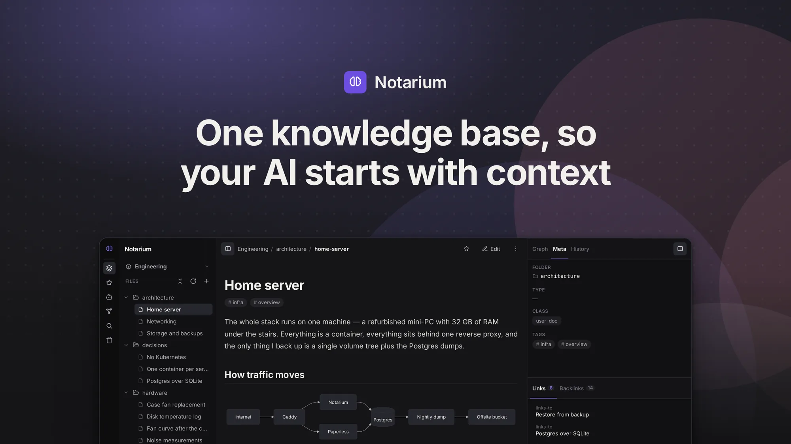
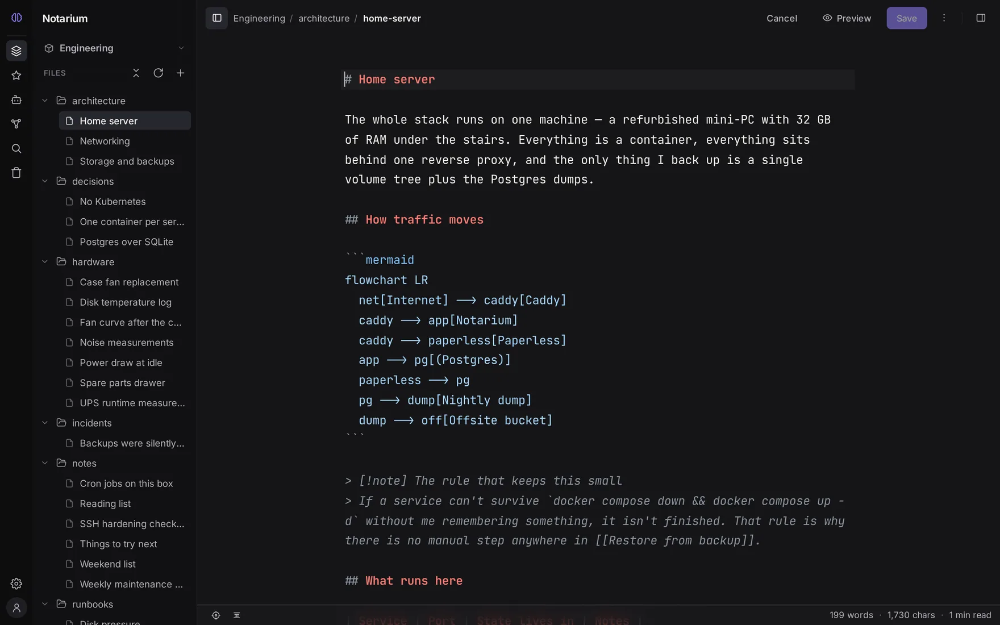
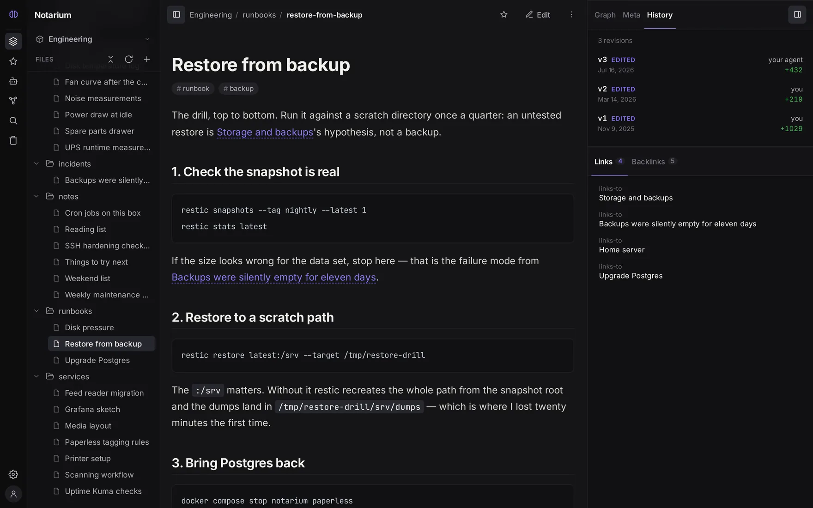
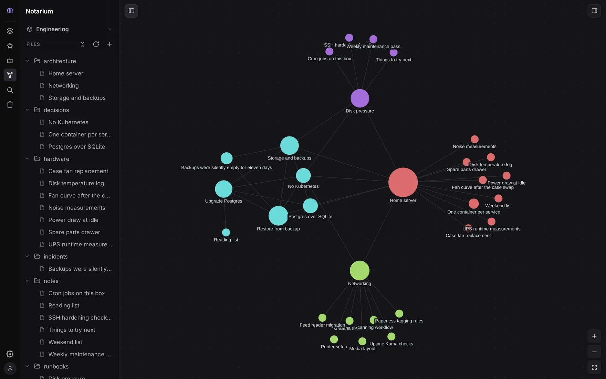
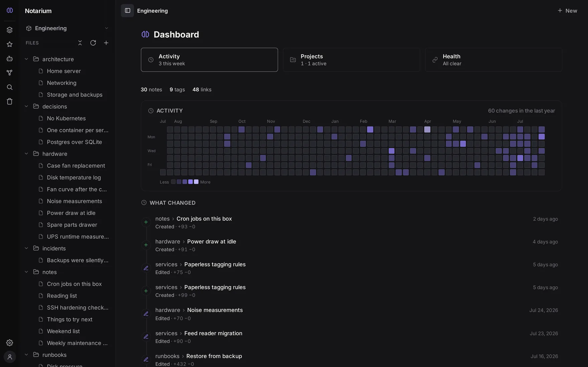

# Notarium

**One knowledge base, so your AI starts with context.** Your agents, Markdown, and editor — in one container.

[Documentation](https://notarium.ai/en/docs/) · [Quick start](https://notarium.ai/en/docs/getting-started/) · [Agents and MCP](https://notarium.ai/en/docs/agents/) · [Roadmap](https://notarium.ai/en/docs/about/roadmap/) · [License](#license)



Notarium is a self-hosted knowledge base built on plain Markdown. A person works in the web editor; an AI agent works through a built-in MCP endpoint — the same notes, the same permissions, the same version history. It runs on your own server as a single container: no external database, no queue, no separate search service.

The `.md` files are the source of truth. The search index, the link graph and the rest of the derived data are rebuilt from them — take the folder and walk away, and you still have your notes.

That structure is also what makes it worth pointing an agent at. A folder of Markdown gives an agent text; a knowledge base gives it links, a graph and search, so it retrieves the context for the task instead of dumping everything into its window.

<details>
<summary><b>More screenshots</b> — the editor, an agent's edit in the version history, the link graph, the dashboard</summary>

<br>

The same knowledge base in every shot: a self-hosted developer's notes about the machine and the services they run. Every picture here is generated from it by `make footage`, never cropped by hand.

**The editor.** The note above, as the `.md` file it actually is — CodeMirror over your own Markdown, with the rendered result a keystroke away.



**One history for you and your agent.** `v3 — your agent` sits in the same revision chain as `v2 — you`: same write path, same permissions, same word-level diff, same rollback. This is the claim the whole project rests on, so it is a screenshot rather than a sentence.



**The graph the notes spell out.** Built from the `[[wikilinks]]` in the files — nothing to curate, nothing to maintain.



**The dashboard.** Ten months of real, backdated activity: what changed, when, and by whom.



</details>

## What you get

**Markdown is the truth.** Notes are ordinary `.md` files, one per note, in real folders. Import and export lose nothing, and without Notarium the files are still complete notes.

**A web editor, not a viewer.** A tree that holds tens of thousands of notes, a CodeMirror 6 editor with a formatting toolbar and hotkeys, and a reading mode with GitHub-flavored Markdown, Mermaid diagrams and KaTeX math. `[[Wikilinks]]` are clickable, including "ghost" links that offer to create the note they point at.

**One base for you and your agent.** A built-in `POST /mcp` endpoint with 23 intent-oriented tools. An agent's edits go through the same write path and the same permissions as yours — versioned, and signed with who made them.

**Search in the core.** Full-text search always works; semantic search is opt-in and merges with it through RRF. Not a premium tier, not a separate subscription.

**History you can trust.** Every note keeps an internal id that survives renames and moves, so its history and inbound links do not break. Full revision history with a word-level diff and rollback, a trash you can restore from, and a record on every revision of whether a human, a specific agent, or an external file editor made it.

**Spaces, people, agents.** A space is an isolated knowledge base with its own index, graph, history and membership; roles are owner / writer / reader. Agents connect with a personal access token or an OAuth 2.1 connector, and a token's scope is the ceiling — a read-only token does not even see the writing tools.

**Your data moves in and out.** Import from Claude and ChatGPT conversations, from MCP memory, and from Markdown; export a space or a folder as a ZIP.

All of it in depth: [notarium.ai/en/docs](https://notarium.ai/en/docs/).

## Start here

Three steps. The first one is the whole setup if you are here for a knowledge base of your own; steps 2 and 3 are for bringing an agent to it.

### 1. Run it

```bash
docker run -d --name notarium \
  -p 3000:3000 \
  -v notarium-data:/data \
  docouno/notarium:latest
```

Open <http://localhost:3000>. The first visit shows a **setup screen** that creates the owner account — there is no preset password, and once the owner registers, setup closes for good. You land in the editor with your own personal space, and that is a working knowledge base.

For an instance you intend to keep, Compose is easier to edit and survives a host reboot:

```yaml
services:
  notarium:
    image: docouno/notarium:latest
    restart: unless-stopped
    ports:
      - "3000:3000"
    volumes:
      - notarium-data:/data

volumes:
  notarium-data:
```

Everything lives in one `/data` volume: your Markdown under `/data/spaces` (one folder per space), the metadata database holding ids, history, users and access, and the derived indexes. There is no data path to configure — which also means there is none to get half-right. Guard the volume, though: your notes leave with it, and the image can take a verified backup without stopping the service — see [Backup and restore](https://notarium.ai/en/docs/self-hosting/backup/).

> **Just for yourself?** You are done — go write something. [Your first note](https://notarium.ai/en/docs/getting-started/first-note/) walks through the tree and the editor, and [Configuration](https://notarium.ai/en/docs/self-hosting/configuration/) covers the settings worth knowing before you put the instance somewhere permanent.

### 2. Connect your agent

The agent talks to the same instance through one endpoint — `POST /mcp`, on the same process and port as the web interface. There is no second service to deploy.

Issue a **personal access token** in **Settings → Account → API tokens** — you pick `read` or `write`, optionally narrow it to specific spaces, and optionally give it an expiry. Then point your MCP client at:

```
POST http://localhost:3000/mcp
Authorization: Bearer ntp_<id>_<secret>
```

The transport is streamable-HTTP from the official MCP SDK — stateless, one JSON response per request. It works with the Claude API MCP connector, Claude Code, and any HTTP MCP client that can send a Bearer token. To check the wiring from a shell:

```bash
curl -sS http://localhost:3000/mcp \
  -H "Authorization: Bearer ntp_<id>_<secret>" \
  -H "Content-Type: application/json" \
  -d '{"jsonrpc":"2.0","id":1,"method":"tools/list"}'
```

The web interfaces of claude.ai and chatgpt.com take no Bearer token — they connect over OAuth, and Notarium ships its own OAuth 2.1 facade for exactly that. Details: [Connecting an agent](https://notarium.ai/en/docs/agents/connect/).

### 3. Put it in your agent's rules

Connecting is half the job. Which tool to call is the model's decision, so the habit of starting from the knowledge base has to live in the agent's standing instructions — `CLAUDE.md`, `AGENTS.md`, Cursor rules, or your system prompt. Three lines cover the main scenario:

```markdown
## Notarium — the project knowledge base

- At the start of a new session, call `start_session(project: "acme/website")`
  on the `notarium` MCP server — profile, available projects, the index of this
  project, what changed since your last visit, and the vocabulary of categories
  already in use.
- **Search before you write:** `search("<topic>", project: "acme/website")` —
  search covers the agent's own memory too, so duplicates get caught.
- Record durable facts about the project with `remember_about_project`, about
  yourself with `remember_about_user`, and shared visible knowledge with
  `create_note`.
```

Substitute your own project handle — `get_my_projects` returns it ready-made, so take it from there rather than deriving it. Without this you end up pointing the agent at your knowledge base by hand every session, and the interaction never starts feeling native.

Skipping it breaks nothing: the other tools stand on their own, and what an agent *may* do is set by the token, never by the text of a rules file. The longer version — a map of your canon, and the split between global and per-project rules — is in [Agent rules](https://notarium.ai/en/docs/agents/agent-files/).

## Running it for real

One process on port `3000` serves the API, the MCP endpoint and the web interface; the knowledge engine runs inside it. That shape is what makes the operational story short:

- **Behind a reverse proxy** — the step people miss is telling Notarium which proxy to trust. Name it in `TRUST_PROXY` (a narrow IP or CIDR) and have the proxy send truthful `X-Forwarded-Host` and `X-Forwarded-Proto`; left unset, forwarded headers are ignored rather than believed. [Production](https://notarium.ai/en/docs/self-hosting/production/)
- **For a team** — move the metadata database to PostgreSQL and keep `/data` on persistent storage. [Database](https://notarium.ai/en/docs/self-hosting/database/)
- **Semantic search** — off in the published image on purpose: the model is real memory and real CPU on a small host, and full-text works without it. `VECTOR_SEARCH=on` turns it on with no rebuild; without the native stack it degrades to full-text rather than failing. [Search setup](https://notarium.ai/en/docs/self-hosting/search-setup/)
- **Operator commands** — `backup`, `backup verify`, `restore`, `admin`, `healthcheck` and `version` ship inside the image as the same `notarium` CLI that runs it. [Image CLI](https://notarium.ai/en/docs/self-hosting/cli/)
- **Every setting**, with defaults and memory costs: [Environment variables](https://notarium.ai/en/docs/reference/environment-variables/)

The published image is `linux/amd64` and carries its own identity: `docker run --rm docouno/notarium:latest version` — or **Settings → About** — prints the version, the commit, and a link to the exact source revision it was built from. Version tags are immutable: a given `X.Y.Z` always means one specific digest, so pinning one is worth doing.

## Honest limits

Two different things live here, and they should not be read as one list.

**Decided, and staying that way.** Notarium is deliberately **not** end-to-end encrypted: search, semantics, history and agents all need the server to read your text. Privacy here comes from owning the files and running the server, not from E2EE — if zero-knowledge is your actual requirement, tools like Anytype or Notesnook are the honest answer. It is also **not a block editor**: the unit of data is a note in a file, not a block in someone else's database, and that is the price of being able to pick up the folder and leave.

**Not there yet.** Real-time collaborative editing, plugins, a full WYSIWYG editor, desktop and mobile apps, offline data, per-note access control, a graph across spaces, external storage adapters. These are directions rather than gaps — where they sit in the order is on the [roadmap](https://notarium.ai/en/docs/about/roadmap/).

**Maturity.** Notarium is at `0.1.0` — an open beta. Deployment is designed for a single instance: the login rate limit and the live-update socket registry live in process memory, so horizontal scaling needs shared state that is not built yet. Multi-tenant pooled hosting with open registration is out of scope until a second isolation boundary exists.

## Documentation

**[notarium.ai/en/docs](https://notarium.ai/en/docs/)** is the documentation — getting started, concepts, everyday guides, agents and MCP, self-hosting, and the configuration reference. It is available in nine languages.

- [Quick start](https://notarium.ai/en/docs/getting-started/) — from zero to a running instance and a first note.
- [Concepts](https://notarium.ai/en/docs/concepts/) — file-first, spaces and projects, the graph, search, versions, access.
- [Agents and MCP](https://notarium.ai/en/docs/agents/) — the tool set, memory, context pins, retrieval audit, security.
- [Self-hosting](https://notarium.ai/en/docs/self-hosting/) — installation, configuration, authentication, backups, production.
- [Import and export](https://notarium.ai/en/docs/import-export/) — bringing data in, and taking it out.

[CHANGELOG.md](CHANGELOG.md) records what changed in each release.

## Contributing

Contributions are welcome, and so is being told what does not work. [CONTRIBUTING.md](CONTRIBUTING.md) covers the repository layout, the scripts, the Docker tooling and the release process, and points into the engineering canon in [docs/](docs/) — the architecture manifesto and the subsystem specs, where the reasoning behind the design lives.

Found a security problem? Do not open a public issue — [SECURITY.md](SECURITY.md) has the private channel, the scope, and what to expect.

## License

**AGPL-3.0-only** (see [LICENSE](LICENSE)). Every feature is open and free, in one codebase — for individuals and for teams, including use inside a company as an internal tool.

A separate **commercial license** is needed only if you monetize Notarium itself as a product: reselling it, running it as a hosted service for third parties, or embedding it in something proprietary you sell. See [COMMERCIAL-LICENSE.md](COMMERCIAL-LICENSE.md).
